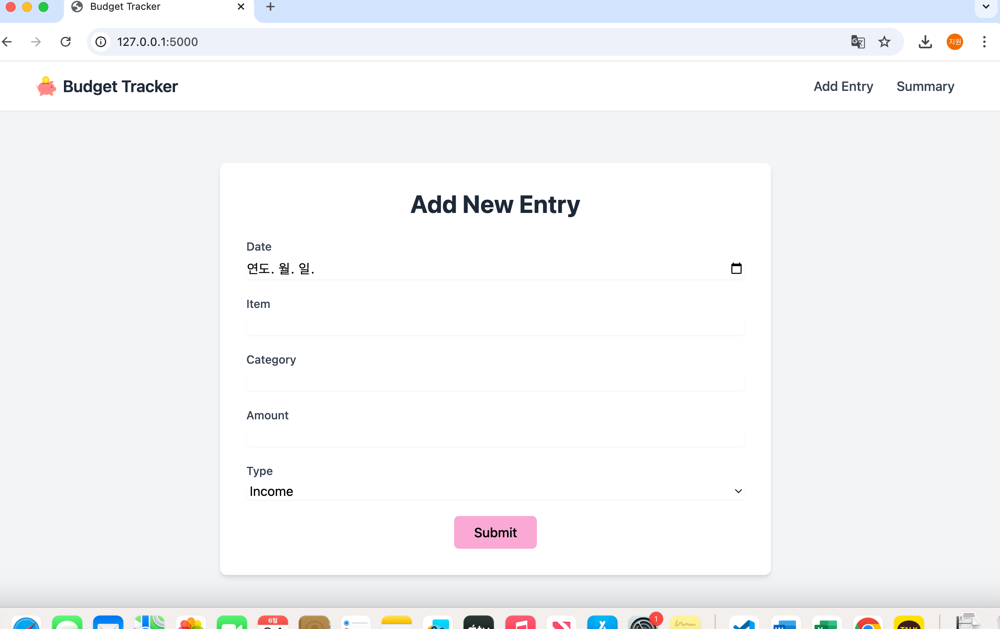

# 🧾 Budget Tracker App (CLI + Flask)

A simple personal budget tracker built with Python.  
First as a **CLI tool**, now upgraded to a **web app** using Flask and TailwindCSS.

---

## 💡 What I Learned

- `csv` and `os` modules for file management
- `pandas` for DataFrame processing and cleaning
- Flask basics: routing, templates, form handling
- TailwindCSS layout and responsive design
- Modularity: shared logic in `utils.py`
- Exception handling for robust data entry

---

## 🖥️ Today’s Progress – Summary Page

✅ Implemented a `/summary` route that:
- Calculates total **income**, **expense**, and **balance**
- Displays the results clearly in a styled HTML table
- Uses `utils.py` to process the CSV and return summarized data
- Connected with the main form page for smooth UX

---

## 🛠 Tech Stack

- Python 3.x
- Flask
- Pandas
- CSV
- TailwindCSS

---

## 🗂 Project Structure

app.py               # Flask app
utils.py             # Reusable logic (add/save/view)

data/
└── budget.csv       # Budget data file

static/
└── images/          # UI icons / screenshots

templates/
├── index.html       # Form page
└── summary.html     # Summary page

venv/                # Virtual environment


---

## 🚀 How to Run

```bash
# 1. Activate venv
source venv/bin/activate

# 2. Run the app
python app.py

```
Then open your browser and go to:
👉 http://127.0.0.1:5000


📌 To Do / Future Improvements

⬇ CSV Export/Download button
🗂 Filter summary by category
🗓 Filter by date or date range
🧱 Move from CSV to SQLite (persistent storage)
🔐 Add User Login System (Flask-Login)
📈 Add visualization with Chart.js (income/expense trends)
✨ Screenshot

Here’s the landing page of the Budget Tracker app:


