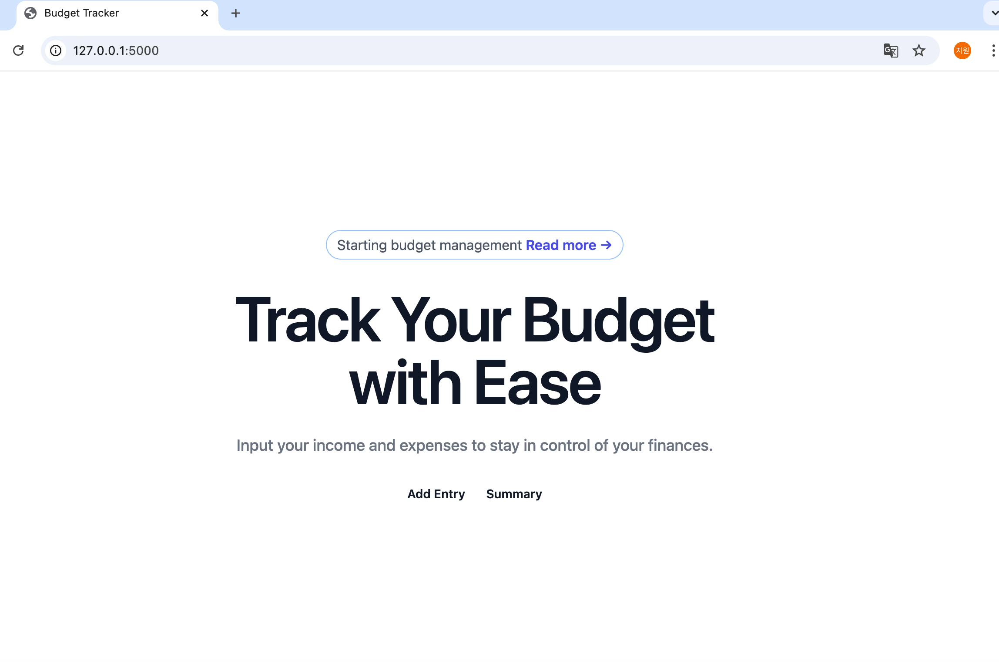

# 🧾 Budget Tracker App (Python CLI)

A simple budget tracker CLI app built with Python, CSV, and Pandas.

## 💡 What I Learned

- How to use `csv` and `os` modules for file management
- Basic `pandas` DataFrame processing and data cleaning
- User input handling and data validation
- Exception handling for robust applications
- How to structure a Python project with modularity (`utils.py`)

## 🛠 Tech Stack

- Python 3.x
- CSV
- Pandas
- CLI-based interaction

## 🗂 Project Structure
budget-tracker/
│
├── utils.py # Functions for adding, saving, summarizing data
├── app.py # CLI runner script
└── data/
└── budget.csv # Stored budget data


This is part of my self-paced curriculum to become a backend developer.  
Check out my GitHub profile for more learning projects.

# 📊 Budget Tracker (Flask + TailwindCSS)

A simple and clean web application to **track income and expenses**, built with **Flask** and styled using **Tailwind CSS**.

---

## ✅ Features

- 💰 Add income and expense entries through a user-friendly form
- 📊 View summary of total income, expenses, and balance
- 📁 Save data to CSV file (`data/budget.csv`)
- 🧠 Reuses CLI logic in `utils.py`
- 🌐 Responsive design using TailwindCSS
- 🖥️ Mobile & desktop navigation support

---

## 🗂️ Project Structure

budget-tracker/
├── app.py # Main Flask app
├── utils.py # Helper functions (add/save/view)
├── data/
│ └── budget.csv # CSV data file
├── templates/
│ ├── index.html # Budget entry form page
│ └── summary.html # Summary page
├── venv/ # Python virtual environment


---

## 🚀 How to Run

### 1. Activate virtual environment

```bash
# macOS/Linux
source venv/bin/activate

# Windows (CMD)
venv\Scripts\activate

# Windows (PowerShell)
venv\Scripts\Activate.ps1

🧾 To Do / Future Improvements

 CSV Export/Download button
 Category filter in summary
 Persistent database (SQLite)
 User login system (Flask-Login)
 Chart visualization (Chart.js)

 ## ✨ Screenshot
Here’s the landing page of the Budget Tracker app:

